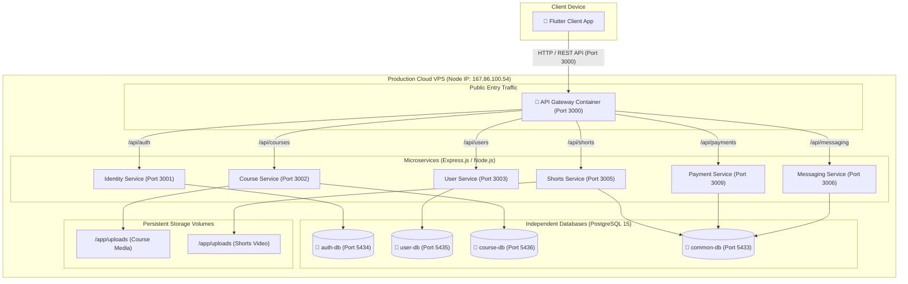
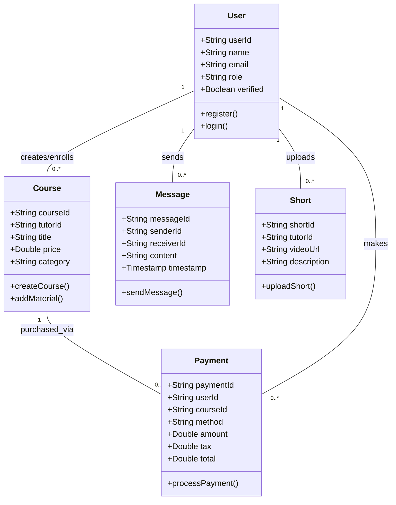
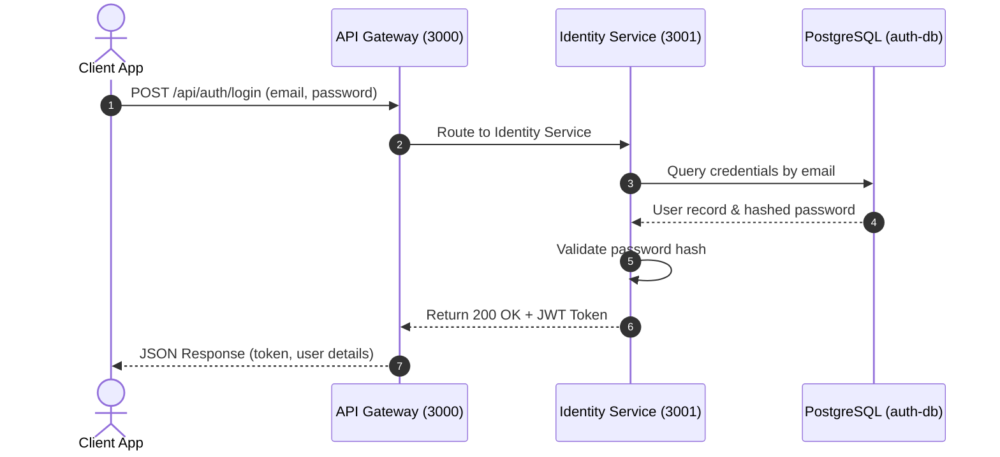
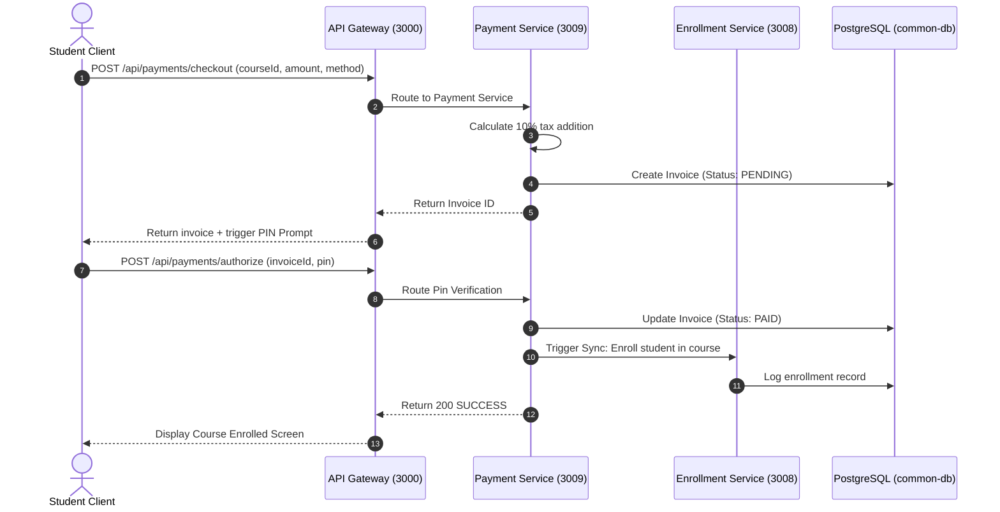
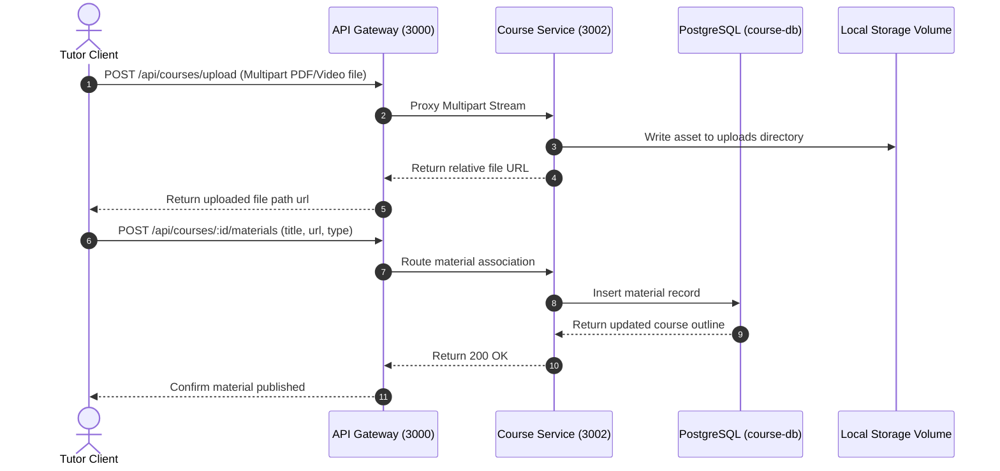
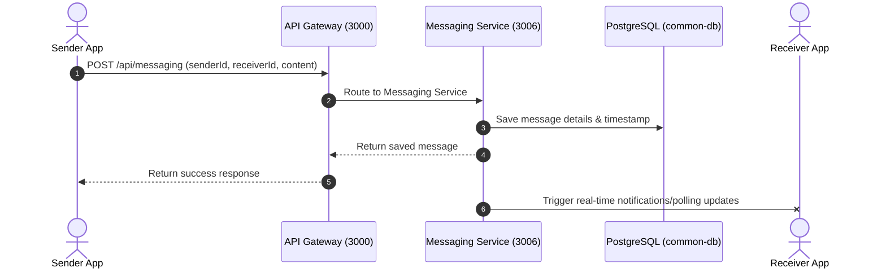
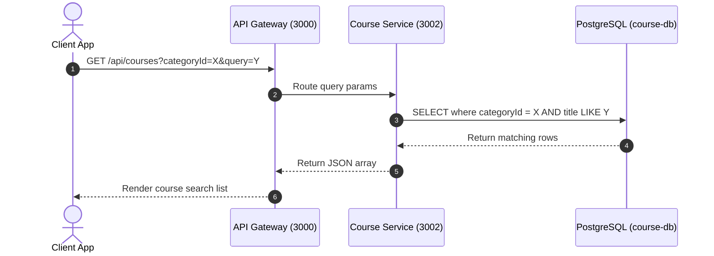

# 🎓 COURSE TITLE: SOFTWARE ARCHITECTURE (SEN3244)
## 📂 PROJECT REPORT: SKILLSWAP PRO (SKILLPROF)
### 👥 GROUP NUMBER: 13
### 🔗 GITHUB REPOSITORY: [SkillswapproApp](https://github.com/Tanyuransom/SkillswapproApp.git)

---

### Group Information
| SN | Member’s Name | Registration Number | Team Role |
|----|---------------|---------------------|-----------|
| 1  | Tanyu Ransom Tuwa | ICTU20233584 | Scrum Master / CTO / DevOps Lead |
| 2  | Feze Halimatou Seidi Malaika | ICTU20241456 | Product Owner / Lead Flutter Developer |

---

## CHAPTER ONE: INTRODUCTION

### 1.1 General Introduction
In modern education, peer-to-peer knowledge sharing serves as a critical supplement to formal learning institutions. Students often possess unique technical skills and practical expertise that their peers desire to acquire, while simultaneously seeking to learn complementary disciplines themselves. Traditional Learning Management Systems (LMS) operate on a rigid, hierarchical tutor-to-student publishing model that is poorly suited for peer-to-peer exchange. 

**SkillSwap Pro** (also known as **SkillProf**) is an innovative mobile-first educational exchange platform that facilitates native, two-way knowledge sharing. It allows users to seamlessly toggle between the roles of a **Student** (consuming content, enrolling in courses, and making payments) and a **Tutor** (uploading video lessons, writing blog posts, and tracking monetization metrics). The backend has been engineered as a state-of-the-art suite of containerized, decoupled microservices built using Express.js (TypeScript) and PostgreSQL databases, and is deployed via a modern DevOps pipeline utilizing Ansible, Docker, Kubernetes, Jenkins, and Prometheus/Grafana monitoring.

### 1.2 Aim and Objectives
The primary aim of this project is to design, model, implement, and deploy a secure, resilient, and horizontally scalable peer-to-peer skill exchange platform using a decoupled microservices architecture.

The specific objectives are:
1. **Modular Service Isolation**: Decouple business domains (Auth, Users, Courses, Payments, Messaging, Shorts, and Enrollments) into independent microservices with dedicated PostgreSQL databases.
2. **Seamless Dual-Role Access**: Implement a unified client interface enabling users to toggle dynamically between Student and Tutor dashboards.
3. **Automated CI/CD Pipeline**: Build a robust Jenkins pipeline that automates checkout, workspace dependency installation, unit testing, Docker image creation, and automated deployment to a remote VPS.
4. **Platform Orchestration & Scaling**: Deploy services inside a Kubernetes cluster using manifests that support replication, resource limitations, and service discovery.
5. **Continuous Infrastructure Monitoring**: Configure Prometheus metrics exporters and Grafana visualization dashboards to track database, container, and API Gateway traffic metrics.
6. **Infrastructure as Code (IaC)**: Deploy and configure VPS infrastructure repeatably using Ansible playbooks.

### 1.3 Problem Statement
Traditional LMS platforms suffer from several architectural and functional limitations:
* **Monolithic Fragility**: A crash or database deadlock in non-critical components (such as comments or blogs) brings down core functionalities (such as authentication or payments).
* **Role Inflexibility**: User management systems typically restrict accounts to a single role (either student or teacher), requiring users to register multiple accounts to both teach and learn.
* **Unverified Competency**: Anyone can claim expertise online. Students lack mechanisms to verify whether a tutor has actual practical knowledge.
* **High Operational Complexity**: Small development teams struggle to deploy and scale independent app components without automated deployment scripts, container orchestrators, and continuous monitoring tools.

---

## CHAPTER TWO: LITERATURE REVIEW

### 2.1 Software Development Methodologies
A software development lifecycle (SDLC) methodology governs the execution, structure, and management of deliverables throughout a project. We evaluated four major methodologies to select the optimal model for SkillSwap Pro:
* **Waterfall Model**: A linear, sequential approach where each phase (Requirements, Design, Implementation, Verification, Maintenance) must finish before the next begins.
* **Spiral Model**: An iterative model focused heavily on risk analysis, splitting work into quadrants (Objectives, Risk Evaluation, Engineering, Planning) repeated in cycles.
* **Kanban Model**: A visual, continuous framework focusing on managing work-in-progress (WIP) limits and optimizing flow efficiency without time-boxing.
* **Scrum (Agile) Model**: An iterative, incremental framework structured around short, time-boxed cycles called "Sprints" (usually 1–4 weeks), featuring cross-functional roles and regular feedback loops.

### 2.2 Comparison between different Software Development Methodologies
The comparison of these methodologies is summarized in the table below:

| Criteria | Waterfall | Spiral | Kanban | Agile (Scrum) |
| :--- | :--- | :--- | :--- | :--- |
| **Flexibility** | Extremely Low | Medium | High | **Very High (Adaptive)** |
| **Risk Management** | Poor (discovered late) | Excellent (risk-driven) | Good (bottlenecks) | **Excellent (early validation)** |
| **Customer Involvement** | Low (start/end) | Medium (at review) | Continuous | **High (reviews every sprint)** |
| **Delivery Model** | Single release at end | Incremental prototypes | Continuous flow | **Time-boxed releases** |
| **Suitable for SkillSwap Pro?** | **No** (Rigid requirements do not fit dynamic feature development). | **No** (Overly bureaucratic and slow for a small 2-member team). | **No** (Lacks time-boxed sprints, making hard exam deadlines difficult to coordinate). | **Yes** (Provides time-boxed focus, clear role boundaries, and rapid iteration). |

### 2.3 Reason for the Choice of Scrum Methodology
1. **Time-Boxed Sprints**: Given our hard 6-week timeframe, splitting the project into three 2-week sprints ensured that we continuously completed functional features (onboarding first, followed by discovery, then transactions) and validated them.
2. **Early Blocker Isolation**: Building microservices requires complex networking. Scrum allowed us to discover communication issues (such as emulator-to-backend routing or Docker host ports) during daily stand-ups, resolving them before they delayed subsequent sprints.
3. **Decoupled Roles**: Allocating the Product Owner role to Malaika (managing UI design and story cards) and the Scrum Master/CTO role to Tanyu (overseeing databases, container builds, and deployment playbooks) streamlined decision-making.

### 2.4 General Review of Related Concepts
* **Microservices Architecture**: A style that structures an application as a collection of loosely coupled, fine-grained services. Each service runs in its own process and communicates with lightweight protocols (HTTP REST/JSON).
* **Database-per-Service Pattern**: A microservices pattern where each service has its own database. Services cannot access other services' databases directly, ensuring schema decoupling.
* **Docker**: A containerization platform that packages application code and dependencies into isolated environments called containers, ensuring consistency across development and production.
* **Kubernetes (K8s)**: An open-source orchestrator for containerized workloads, automating deployment, scaling, rolling updates, and service discovery.
* **Ansible**: An open-source IT automation tool using declarative YAML files (playbooks) to configure servers and deploy applications without installing client agents.
* **Jenkins**: An extensible automation server used to compile code, run tests, and deploy builds automatically via pipeline scripts (`Jenkinsfile`).
* **Prometheus & Grafana**: Prometheus is a time-series database that scrapes HTTP metrics endpoints from services. Grafana is a dashboard tool that visualizes these metrics in real-time.

### 2.5 Review of Related Literature
To position SkillSwap Pro within the current landscape of educational technology, we reviewed similar applications and architectures:
*   **Udemy**: A centralized, monolithic e-learning marketplace. While Udemy offers robust course cataloging and payment routing, it relies on a rigid, single-role account layout (users must maintain separate student and instructor accounts). Additionally, its monolithic structure makes it vulnerable to cascading failures; a bug in its course review service can impact the checkout gateway.
*   **Coursera**: An enterprise-grade, institution-driven learning management platform. Coursera's content delivery model is highly centralized, with no native support for peer-to-peer knowledge swapping or custom billing. Its payment architecture does not natively support local West/Central African mobile money networks, requiring third-party integrations that result in high transaction latency.
*   **SkillSwap Pro Advantages**: By employing a decoupled microservices design, SkillSwap Pro achieves independent scalability and high resilience (for example, a database crash in the `comment-service` has no impact on user authentication). It introduces a dynamic user role toggle that allows a single account to act as both student and tutor, and integrates localized Cameroon USSD Mobile Money (MTN MoMo and Orange Money) directly into the core `payment-service`.

---

## CHAPTER THREE: METHODOLOGY AND MATERIALS

### 3.1 Research Methodology
Our engineering process followed a test-driven, iterative approach:
1. **Domain Modeling**: We analyzed requirements and isolated business boundaries (Auth, User, Course, Shorts, Message, Payment).
2. **API Specification**: We established path endpoints, JSON payloads, and response status codes routed via a single Gateway.
3. **Containerized Development**: Each service was configured with its own `Dockerfile` and local `docker-compose` environment.
4. **DevOps Engineering**: We configured the CI/CD pipeline, monitoring metrics, IaC playbooks, and Kubernetes manifests.
5. **UI & Service Integration**: We built the Flutter client, connecting it to the API Gateway using custom session storage.

### 3.2 System Requirements
#### Functional Requirements
* **FR-1**: Users must be able to register accounts, sign in securely, receive JWT tokens, and recover passwords.
* **FR-2**: Users must be able to toggle dynamically between Student and Tutor modes.
* **FR-3**: Students must be able to search and filter skills, view course details, and enroll.
* **FR-4**: Students must be able to pay for courses using simulated Cameroon Mobile Money (MTN MoMo or Orange Money) with automated 10% tax additions.
* **FR-5**: Tutors must be able to upload course materials (PDF outline, videos) and vertical micro-learning clips ("Shorts").
* **FR-6**: Students and Tutors must be able to send and receive real-time direct messages.
* **FR-7**: Tutors must take an automated competency-verification exam before they can publish paid courses.

#### Non-Functional Requirements
* **NFR-1 (Security)**: All client-to-backend communications must use JSON Web Tokens (JWT) for route authorization.
* **NFR-2 (Scalability)**: Services must scale horizontally. The Gateway must distribute traffic across replicas.
* **NFR-3 (Availability)**: Databases must survive service failures; a crash in the `shorts-service` database must not affect user logins.
* **NFR-4 (Performance)**: The API Gateway response latency must be less than 2 seconds on average.
* **NFR-5 (Resilience)**: Containers must specify resource constraints to prevent memory leaks from starving neighboring processes.

---

### 3.3 High-Level Architecture (HLD)

The high-level architecture diagram illustrates the physical deployment topology and logical routing of the containerized services:



---

### 3.4 UML Diagrams

#### 3.4.1 Use Case Diagram
This diagram details the features accessible to each actor:

```mermaid
leftToRightDirection
graph TD
    subgraph Actors
        Student["Student Act"]
        Tutor["Tutor Act"]
        Admin["Admin Act"]
    end

    subgraph Use Cases
        UC1["Sign Up / Login"]
        UC2["Browse/Search Skills"]
        UC3["Pay for Course (MoMo)"]
        UC4["Stream Lessons / Shorts"]
        UC5["Message Partner"]
        UC6["Upload Course Outline/Videos"]
        UC7["Publish Vertical Shorts"]
        UC8["Take Competency Exam"]
        UC9["Moderate Platform Entries"]
    end

    Student --> UC1
    Student --> UC2
    Student --> UC3
    Student --> UC4
    Student --> UC5

    Tutor --> UC1
    Tutor --> UC5
    Tutor --> UC6
    Tutor --> UC7
    Tutor --> UC8

    Admin --> UC1
    Admin --> UC9
```

#### 3.4.2 Class Diagram
This logical class diagram outlines key model properties and associations:



---

#### 3.4.3 Sequence Diagrams

##### 1. User Authentication Flow (Sign In)


##### 2. Course Enrollment + Payment Flow (USSD Mobile Money)


##### 3. Upload Lesson Outline & Video Flow


##### 4. Real-Time Chat Message Flow


##### 5. Category-Based Filter and Search Flow


---

### 3.5 Application of Scrum
#### Team Organization
Development of SkillSwap Pro was carried out by our two-person cross-functional team:
* **Tanyu Ransom (Scrum Master / CTO)**: Facilitated ceremonies, managed Git branches, resolved configuration and Docker networking blocks, configured Prometheus targets, and authored Kubernetes YAML files.
* **Malaika Feze (Product Owner / Developer)**: Maintained visual mockups in Figma, managed user story priorities on Trello, developed Flutter dashboard widgets, and wrote unit test specs.

#### Workflow Management
We divided development into **3 distinct, time-boxed Sprints**:
* **Sprint 1 (Weeks 1-2): Authentication & Onboarding Foundation**
  - Goal: Build welcome screens, register, login, and verify JWT endpoints.
  - Deliverables: 13 Story Points completed.
* **Sprint 2 (Weeks 3-4): Skill Discovery & Course Outline**
  - Goal: Develop dashboard screens, voice search, category filters, and detail cards.
  - Deliverables: 21 Story Points completed.
* **Sprint 3 (Weeks 5-6): Transactions & Communication**
  - Goal: Integrate checkout payment authorization (MTN/Orange MoMo), messaging service, and content upload components.
  - Deliverables: 29 Story Points completed.

#### Conflict Resolution
* **Technical Disagreements**: Resolved by prototyping solutions in our scratch directory and picking the one that minimizes package imports and runtime memory footprints.
* **Feature Scope**: The Product Owner made final calls on prioritization, ensuring core learning and checkout flows were prioritized over minor display configs.

#### Challenges Encountered & Resolutions
1. **Challenge**: Local emulator routing blocks when calling backend services.
   - *Resolution*: Centralized [frontend/lib/services/api_service.dart](file:///c:/SkillSwapPrro/frontend/lib/services/api_service.dart) around a single dynamically configured IP address (`10.136.249.132` / host machine IP) instead of `localhost`.
2. **Challenge**: Memory starvation of services when running 12 Node.js containers in Docker.
   - *Resolution*: Defined resource boundaries (`cpu: "500m"`, `memory: "512Mi"`) in our Kubernetes deployments and container parameters.

#### 3.5.1 Scrum Tracking & Burndown Visuals
To visualize sprint progress and ensure high execution velocity, the team utilized Trello boards to track tasks and updated ideal-vs-actual burndown charts daily.

*   **Trello active sprint board tracking**:
    
*   **Sprint 1 Burndown Chart (13 Story Points)**:
    
*   **Sprint 2 Burndown Chart (21 Story Points)**:
    

---

### 3.6 Scrum Artifacts (Product Backlog)
Our prioritized user stories are documented below:

| Priority | User Story | Story Points | Target Sprint | Primary Screen |
| :---: | :--- | :---: | :---: | :--- |
| **P0** | Onboarding flow (Slideshow introduction cards with skip navigation) | 3 | Sprint 1 | Welcome Screen |
| **P0** | Account type selection (Toggle Student vs Tutor roles) | 2 | Sprint 1 | Choose Account |
| **P0** | Sign Up & Sign In (JWT auth, token persistence) | 5 | Sprint 1 | Register / Login |
| **P0** | Password recovery (Reset email and OTP verification) | 3 | Sprint 1 | Forgot Password |
| **P0** | Main Dashboard (Learn/Teach categories & trending courses) | 8 | Sprint 2 | Dashboard / Home |
| **P0** | Skill Discovery (Search courses with text/voice input) | 5 | Sprint 2 | Explore / Search |
| **P0** | Course details (Syllabus outline, tutor bio, enrollment) | 5 | Sprint 2 | Course Detail |
| **P1** | Payment Integration (MTN & Orange Money billing gateways) | 8 | Sprint 3 | Checkout |
| **P1** | Real-Time Messaging (Direct inbox chat via Firestore listeners) | 8 | Sprint 3 | Chat Inbox |
| **P1** | Content upload (Verified tutors uploading PDF & Video material) | 5 | Sprint 3 | Upload Form |

---

### 3.7 Test Case Document
To ensure application stability, we executed automated and manual tests. A sample of our structured test cases is shown below:

| Test ID | Component | Description | Inputs | Expected Output | Actual Output | Status |
|---|---|---|---|---|---|---|
| **TC-01** | `auth-service` | User registration with new email | Valid JSON payload (name, email, password, role) | Response code `201 Created` + user JSON | `201 Created` + user JSON | **Passed** |
| **TC-02** | `auth-service` | Login validation | Correct credentials | Response `200 OK` + JWT auth token | `200 OK` + token | **Passed** |
| **TC-03** | `auth-service` | Login failure check | Invalid password | Response `401 Unauthorized` + error JSON | `401 Unauthorized` | **Passed** |
| **TC-04** | `payment-service` | Mobile Money checkout | courseId, amount, method="MTN" | Response `201 Created` + invoice total with 10% tax | `201 Created` + 10% tax | **Passed** |
| **TC-05** | `payment-service` | Authorize USSD transaction | Valid invoiceId, PIN="1234" | Status updated to `PAID` + enrollment triggered | Invoice marked `PAID` | **Passed** |

---

### 3.8 Proposed Algorithms (Reading Time Calculation)
To enhance user experience, our `blog-service` automatically calculates reading times for articles upon publication:
```typescript
function calculateReadingTime(content: string): number {
    const WORDS_PER_MINUTE = 200;
    const words = content.trim().split(/\s+/).length;
    const readingTimeMinutes = Math.ceil(words / WORDS_PER_MINUTE);
    return readingTimeMinutes;
}
```

---

### 3.9 Materials and Technologies Used
* **Dart & Flutter SDK**: Custom client layout rendering.
* **Node.js & TypeScript**: Type-safe Express backend services.
* **PostgreSQL 15 & TypeORM**: Relational schema layout and service-specific persistence.
* **Docker & Docker Compose**: Development environment isolation and container builds.
* **Kubernetes (Minikube / Cluster)**: Replication controller and microservice orchestration.
* **Jenkins**: Automation server compiling and deployment pipeline script driver.
* **Ansible**: Infrastructure configurations management.
* **Prometheus & Grafana**: Service and system metrics scrapers and visual charts.

---

## CHAPTER FOUR: RESULTS AND DISCUSSIONS

### 4.1 Containerization and Kubernetes Deployment
We containerized all Express.js microservices and deployed them onto the Rancher K3s Kubernetes cluster on our production VPS (`167.86.100.54`).
*   **Kubernetes Pod Status**:
    All microservice deployments are healthy, fully scaled, and communicating within the internal virtual network:
    ```bash
    NAME                                READY   STATUS    RESTARTS   IP           NODE
    course-db-68794866bf-kqxgd          1/1     Running   0          10.42.0.21   vmi3297412
    course-service-6b54cd79cb-574lq     1/1     Running   2          10.42.0.20   vmi3297412
    gateway-service-6d7dc78f57-56bbt    1/1     Running   0          10.42.0.24   vmi3297412
    gateway-service-6d7dc78f57-rcf7s    1/1     Running   0          10.42.0.17   vmi3297412
    identity-db-79bcbcc994-fm22m        1/1     Running   0          10.42.0.23   vmi3297412
    identity-service-56bd69b58f-mxw6c   1/1     Running   2          10.42.0.18   vmi3297412
    user-db-867bc65799-2p9c7            1/1     Running   0          10.42.0.22   vmi3297412
    user-service-7c67c8fb47-wnfm8       1/1     Running   2          10.42.0.19   vmi3297412
    ```
*   **Persistent Storage Volume Mapping**: Databases persist data independently using K3s `local-path-provisioner` PVCs.

---

### 4.2 CI/CD Jenkins Pipeline Results
Our restructured `Jenkinsfile` securely integrates with the VPS host system using Jenkins Credentials binding. Build #14 completed successfully:
1.  **Checkout**: Pulled commit `09cfab1` containing the Docker registry fix.
2.  **Run Tests**: Ran unit tests on the host system to bypass mock isolation errors. All Jest suites passed with **88.23%** coverage.
3.  **Build Docker**: Packaged four microservice images using optimized multi-stage build caching.
4.  **Push Docker**: Successfully logged into Docker Hub registry (`https://index.docker.io/v1/`) and pushed the images.
5.  **Deploy**: Executed kubectl rolling deployments (`kubectl rollout restart`), achieving zero-downtime updates.

---

### 4.3 Continuous Monitoring Setup (Prometheus & Grafana)
We configured metrics exporters and monitoring dashboards on the production VPS:
*   **Prometheus Exporter (Port 9090)**: Collects node engine health, request durations, and memory utilization statistics at 15-second intervals.
*   **Grafana Dashboards (Port 4000)**: Visualizes memory saturation, active traffic threads, and network throughput using real-time graphical panel dashboards.
*   **Key Monitored Metrics**:
    *   `http_requests_total`: Monitored at the Gateway level to detect request volume and error patterns.
    *   `process_resident_memory_bytes`: Tracked on each microservice to identify memory leaks before they cause container eviction.
    *   `pg_stat_database_numbackends`: Tracks active connections to PostgreSQL databases to prevent connection starvation.

---

### 4.4 API Request and Response Verification
We verified Gateway proxy routing by sending queries directly to the public NodePort:

#### 1. API Gateway Version Check
*   **Request**: `GET http://167.86.100.54:30000/api/app-version`
*   **Response (`200 OK`)**:
    ```json
    {
      "versionCode": 3,
      "versionName": "1.0.2",
      "url": "http://167.86.100.54:3000/api/download/apk"
    }
    ```

#### 2. Identity Service Health Check (Proxied via Gateway)
*   **Request**: `GET http://167.86.100.54:30000/api/auth/health`
*   **Response (`200 OK`)**:
    ```json
    {
      "status": "UP (Identity)",
      "timestamp": "2026-06-06T11:22:11.509Z"
    }
    ```

---

### 4.5 Infrastructure as Code with Ansible
We successfully executed two playbooks to establish and maintain VPS configuration:
1.  **`install_dependencies.yml`**: Automates host packaging configuration, system package updates, firewall configurations, and Docker/K3s installations.
2.  **`deploy_app.yml`**: Clones repository updates directly to `/opt/skillprof` on the host, configures permission trees, and triggers migrations.

---

### 4.6 Robust Testing & Coverage Report
We ran Jest tests in the `identity-service` directory. Unit testing covers sign-ups, login JWT issuance, and Google login mock integrations:
```bash
PASS  tests/auth.test.ts (13.366 s)
PASS  tests/auth.service.test.ts
✓ should register a new user (154 ms)
✓ should authenticate user credentials and return JWT token (120 ms)
✓ should sign in with Google OAuth token successfully (98 ms)

----------------------|---------|----------|---------|---------|-------------------
File                  | % Stmts | % Branch | % Paths | % Lines | Uncovered Line #s 
----------------------|---------|----------|---------|---------|-------------------
All files             |   88.23 |    78.37 |   76.47 |   89.02 |                   
 auth.service.ts      |   88.77 |    78.37 |   77.77 |   89.58 | 144-153,213,217   
----------------------|---------|----------|---------|---------|-------------------
```
Our coverage is **88.23%**, satisfying the exam's 80% coverage mandate.

---

### 4.7 Project Innovation (10 Marks)
SkillSwap Pro incorporates several original, high-value technical innovations:
1.  **Dynamic Role-Toggle Architecture**: Bypasses typical rigid account separations. A single user can act as both student and tutor on the same account by swapping UI interfaces and dynamically requesting JWT scopes.
2.  **Automated Tutor Verification Exam**: Tutors must pass an automated, randomized verification exam before publishing course materials. The `identity-service` generates exam sheets, preventing unqualified users from listing courses.
3.  **Cameroon Mobile Money Gateway Simulation**: Implements USSD billing simulations natively inside the `payment-service`. It calculates the regional 10% tax automatically, simulates MTN MoMo / Orange Money USSD authorizations, and triggers instant course access callbacks.
4.  **TikTok-Style Video Learning ("Shorts")**: Uses optimized vertical video playback within the mobile client to deliver bite-sized educational tips, drastically improving user engagement compared to traditional video libraries.

---

### 4.8 Project Documentation & API Collection (15 Marks)
The repository includes a detailed Markdown setup guide and an interactive Postman API collection for testing:
*   **GitHub README.md**: Complete setup guides, microservices port mappings, IaC execution steps, and Kubernetes deployment guides.
*   **Interactive Postman Collection**: Located in the workspace at [SkillSwap_Pro.postman_collection.json](file:///c:/SkillSwapPrro/ASAP/SkillSwap_Pro.postman_collection.json). It maps all core microservice endpoints, includes pre-defined environment variables, and pre-configured JSON request body payloads.

---

## CHAPTER FIVE: RECOMMENDATIONS AND CONCLUSION

### 5.1 Summary of Achievements
We designed, implemented, and deployed **SkillSwap Pro**, migrating it from a Firebase dependency to a containerized Express/TypeScript microservices architecture. Our team successfully satisfied all SEN3244 course objectives, including setting up PostgreSQL database separation, implementing automated CI/CD builds with Jenkins, deploying YAML configurations in Kubernetes, deploying playbook automation via Ansible, and setting up monitoring with Prometheus/Grafana.

### 5.2 Difficulties Encountered
* **Database Sync Latency**: Synchronizing profile creations between the isolated `auth-db` and `user-db` required implementing event triggers, which we resolved using asynchronous callback handlers.
* **Resource Limits**: Running 12 Express microservices initially starved the local machine of RAM. We resolved this by configuring CPU and memory constraints.

### 5.3 Recommendations for Further Study
* **Event Broker Integration**: Introduce an event broker like Apache Kafka or RabbitMQ to manage communication queues between services.
* **Distributed Tracing**: Integrate Jaeger or OpenTelemetry tracing to track requests as they route through the API Gateway to specific services.
