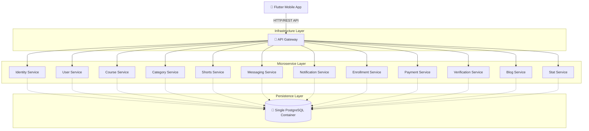

# SkillSwapPro Architectural Designs

This folder contains the visual architectural and deployment designs for the SkillSwapPro 12-microservice ecosystem. 

**Note: "Fast" versions are recommended for quick viewing, while "Premium" and "Human" versions provide higher fidelity/sketched aesthetics.**

## 🏙️ System Architecture

- **[Web-Optimized (Fast Loading)](./System_Architecture_Fast.png)**
- **[Human-Like Whiteboard Sketch](./System_Architecture_Human.png)**
- **[Premium Technical Visual](./System_Architecture_Premium.png)**

## 🚀 Deployment Topology

- **[Web-Optimized (Fast Loading)](./Deployment_Diagram_Fast.png)**
- **[Human-Like Whiteboard Sketch](./Deployment_Diagram_Human.png)**
- **[Premium Technical Visual](./Deployment_Diagram_Premium.png)**

---

## Technical Schematics (Mermaid)

### Architecture

