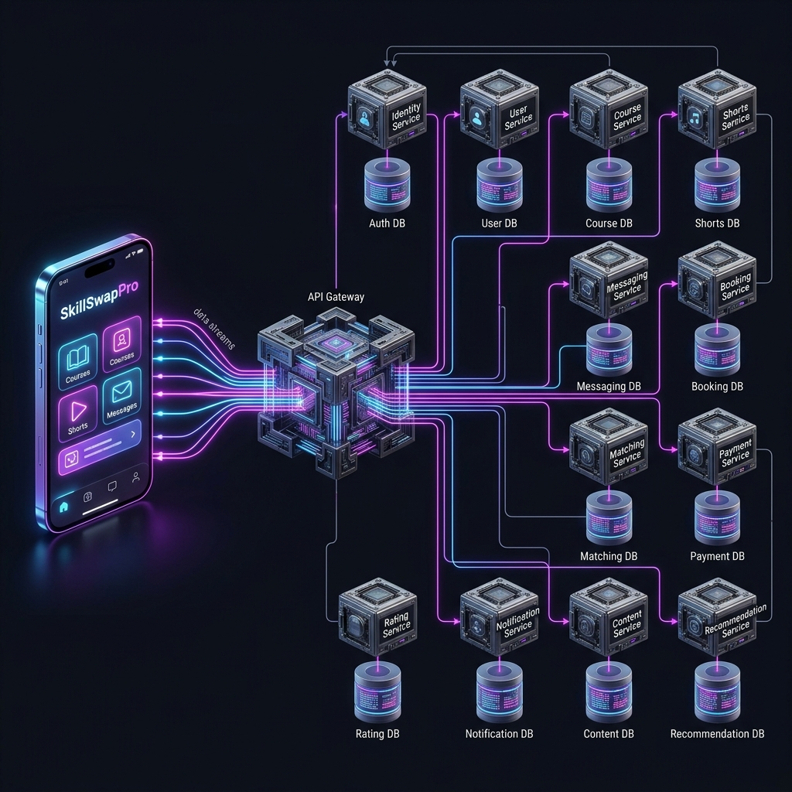
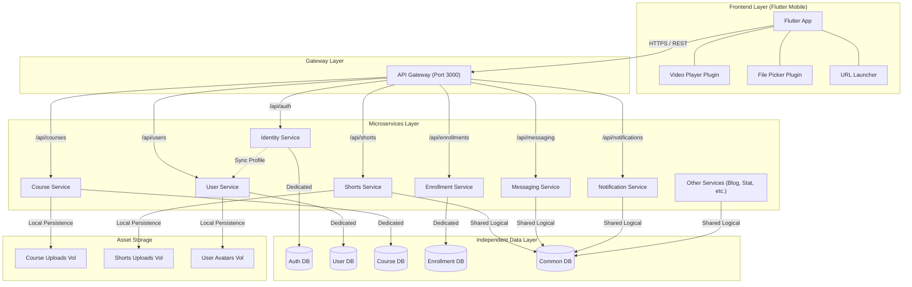
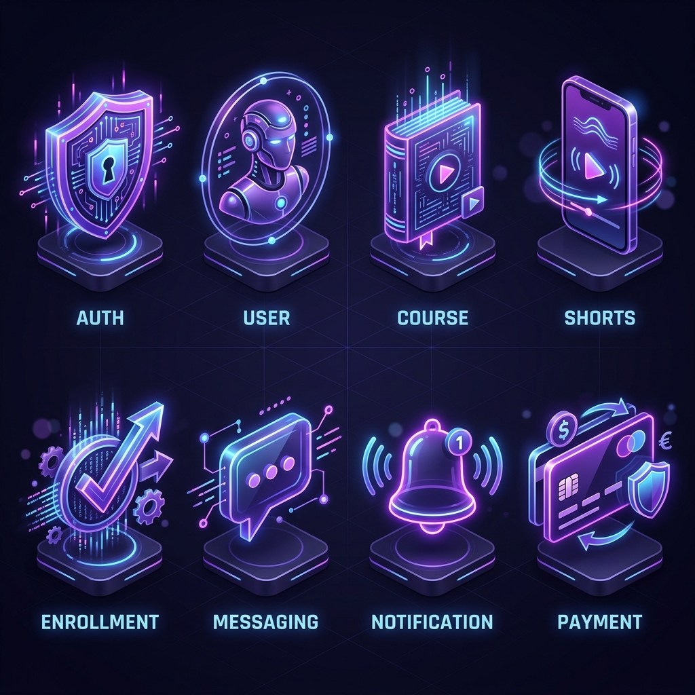

# SkillSwapPro - Decoupled Microservice Architecture

This document outlines the state-of-the-art decoupled architecture of the SkillSwapPro platform, featuring independent services and dedicated data persistence.

## 1. Detailed System Map (Hero View)

## 2. Additional Architectural Diagrams

### 2.1. Deployment Diagram (VPS Node & Network Placement)

### 2.2. System Architecture (Decoupled Logical Blueprint)

## 3. Architectural Blueprint (Logical)

## 4. Key Architectural Improvements

### 4.1. Database Independence
Unlike traditional monoliths or tightly coupled microservices, SkillSwapPro now uses **separate Postgres instances** for its core domains:
- **Auth DB**: Isolated credentials and identity data.
- **User DB**: Dedicated storage for profiles and user preferences.
- **Course DB**: Independent management of courses, materials, and reviews.
- **Enrollment DB**: High-concurrency tracking of student participation.

### 4.2. Frontend Media Integration
The Flutter frontend has been enhanced with native capabilities:
- **`video_player`**: Direct in-app playback for course videos.
- **`file_picker`**: Seamless upload of course documents and materials.
- **`url_launcher`**: External handling for specialized files like PDFs.

### 4.3. Resilient Asset Routing
All media assets are proxied through the **API Gateway**, ensuring a consistent entry point for the mobile app while allowing services to manage their own storage volumes independently.

---

## 5. Service Visual Identity

Each microservice in the SkillSwapPro ecosystem is designed with a specific domain focus, represented by the following visual identity system:

### Core Service Breakdown:
- **Shield**: Identity & Auth Service
- **Profile**: User Management Service
- **Book**: Course & Learning Service
- **Video**: Shorts & Content Service
- **Check**: Enrollment & Validation Service
- **Chat**: Messaging & Real-time Service
- **Bell**: Notification & Alert Service
- **Card**: Payment & Transaction Service

---

## 6. Technical Infrastructure (Docker Images)

The following Docker images power the SkillSwapPro infrastructure, ensuring lightweight and consistent deployment:

| Service | Docker Image / Context | Purpose |
|---------|-----------------------|---------|
| **API Gateway** | `backend-gateway-service` | Entry point & Proxy |
| **Identity Service** | `backend-identity-service` | JWT Auth & Roles |
| **User Service** | `backend-user-service` | Profiles & Avatars |
| **Course Service** | `backend-course-service` | Course Content & Reviews |
| **Enrollment Service** | `backend-enrollment-service` | Enrollment State |
| **Shorts Service** | `backend-shorts-service` | Short Video Content |
| **Databases** | `postgres:15-alpine` | High-performance SQL |
| **Cache** | `redis:7-alpine` | Real-time messaging |

---

## 7. Architectural Style Justification
*   **Decoupled Microservices**: Chosen to support the modular lifecycle of educational platform elements. Features like TikTok-style **Shorts** require heavy video handling and high throughput. Separating it into `shorts-service` ensures video load spikes do not interrupt core authentication (`identity-service`) or messaging flows.
*   **Database-per-Service Pattern**: Protects critical data. A security threat or performance bottleneck in a public review/comment service cannot affect the primary credential tables (`auth-db`).
*   **Event-Driven Sync**: Identity changes (registration/updates) are propagated from `identity-service` to `user-service` asynchronously, minimizing operational coupling.

## 8. Quality Attributes & Trade-offs
*   **Scalability vs. Network Complexity**:
    *   *Advantage*: Each service is containerized and runs independently, allowing selective scaling via Kubernetes.
    *   *Trade-off*: All client requests route through the API Gateway, introducing slight network latency overhead compared to a direct monolithic call.
*   **Data Isolation vs. Consistency**:
    *   *Advantage*: Absolute domain isolation; data changes are local and secure.
    *   *Trade-off*: Requires inter-service synchronization (e.g. sync between identity and user service) which operates on eventual consistency rather than ACID transactions.

## 9. Pros and Cons of Chosen Architecture
*   **Pros**:
    *   **Fault Isolation**: If the `shorts-service` crashes due to video encoding issues, students can still log in, read blogs, message tutors, and make payments.
    *   **Modular Tech Selection**: Services can use localized database schemas (SQL for identity, document store or search indices for courses).
    *   **Independent Deployability**: CI/CD (Jenkins) can redeploy updated services without bringing down other parts of the app.
*   **Cons**:
    *   **Deployment Overhead**: Requires orchestrating 22 separate database and service containers.
    *   **Difficult Local Debugging**: Mocking and testing integrations require significant tooling (resolved via Docker Compose profiles).

---
*Generated by Antigravity AI - 2026-06-05*
